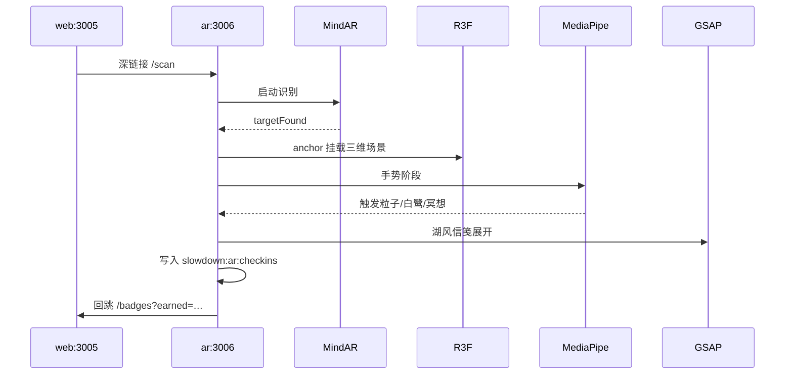

# 《宁可慢一点》AR 子项目架构

> 独立 Vite 应用，端口 **3006**（HTTPS），与主站（[`../`](../)）及 `(immersive)/experience` 视觉交互隔离运行。

## 技术栈

| 层级 | 库 | 职责 |
|---|---|---|
| AR 引擎 | [MindAR.js](https://github.com/hiukim/mind-ar-js) | 图片识别、相机、Three.js anchor |
| 三维 | React Three Fiber + drei | 水波、粒子、IP 吉祥物 |
| 手势 | MediaPipe Hands + fingerpose | 张开手掌 / 合十 / 挥手 / 比心 |
| 动画 | GSAP | 扫描框、信笺展开、打卡与分享转场 |

## 目录

```
ar/
├── public/
│   ├── markers/          # 立牌原图（编译输入）
│   └── targets/          # .mind 识别目标
├── src/
│   ├── config/spots.ts   # 点位配置
│   ├── bridge/           # localStorage 与主站回跳
│   ├── mindar/           # MindAR hook
│   ├── scenes/           # R3F 场景（按点位）
│   ├── gestures/         # MediaPipe 手势
│   ├── animations/       # GSAP 时间轴
│   └── pages/            # 路由页面
└── vite.config.ts        # HTTPS + 3006
```

## 路由

| 路径 | 页面 |
|---|---|
| `/scan?spot=xuanwu-lake&return=/badges` | MindAR 扫描入口 |
| `/experience/:spotId` | 识别后 AR 体验（场景 → 手势 → 信笺） |
| `/checkin/:spotId` | 打卡完成 |
| `/share/:spotId` | 分享页 |

## 与主站衔接

### 深链接（推荐）

主站地图 POI 卡片跳转：

```
{NEXT_PUBLIC_AR_BASE_URL}/scan?spot=xuanwu-lake&return=/badges&webBase=http://localhost:3005
```

实现见 [`../src/lib/ar/links.ts`](../src/lib/ar/links.ts)。

### localStorage 桥接

AR 打卡完成后写入：

- **Key**: `slowdown:ar:checkins`
- **Value**: `ArCheckinRecord[]`

```json
{
  "spotId": "xuanwu-lake",
  "badgeId": "xuanwu-lake-letter",
  "at": "2026-06-27T12:00:00.000Z",
  "certHash": "…",
  "letterTitle": "湖风信笺"
}
```

主站读取：[`../src/lib/ar/checkins.ts`](../src/lib/ar/checkins.ts)。

## MindAR 目标图编译

详见 [`src/mindar/compile-targets.md`](./src/mindar/compile-targets.md)。

```bash
cd AR
npx mind-ar-js-image-compiler ./public/markers/xuanwu-lake-poster.png -o ./public/targets/xuanwu-lake.mind
```

> 仓库内 `xuanwu-lake.mind` 当前为 MindAR 官方 card 示例，仅用于开发联调。正式部署前必须用玄武湖立牌海报重新编译。

开发测试：

- 使用 `public/markers/dev-card-reference.png` 对准相机，或
- 扫描页点击「演示模式」

## 本地开发

```bash
# 终端 1 — 主站（在 web 根目录）
npm run dev

# 终端 2 — AR（HTTPS，手机需访问 https://<局域网IP>:3006）
cd AR && npm run dev
```

环境变量：

| 项目 | 变量 | 默认 |
|---|---|---|
| web | `NEXT_PUBLIC_AR_BASE_URL` | `http://localhost:3006` |
| ar | `VITE_WEB_BASE_URL` | `http://localhost:3005` |

## 体验流程



## 部署

| 环境 | 建议 |
|---|---|
| 开发 | web `:3005`，ar `:3006`（HTTPS） |
| 生产 | 主域 + AR 子域（如 `ar.example.com`），或反向代理 `/ar` → 3006 |

QR 立牌可直接指向：

```
https://ar.example.com/scan?spot=xuanwu-lake
```

## Phase 2 扩展点位

在 `AR/src/config/spots.ts` 增加配置，编译对应 `.mind`，在 `scenes/` 添加子场景即可。模板点位：梧桐大道、紫金山、秦淮河、明城墙。
