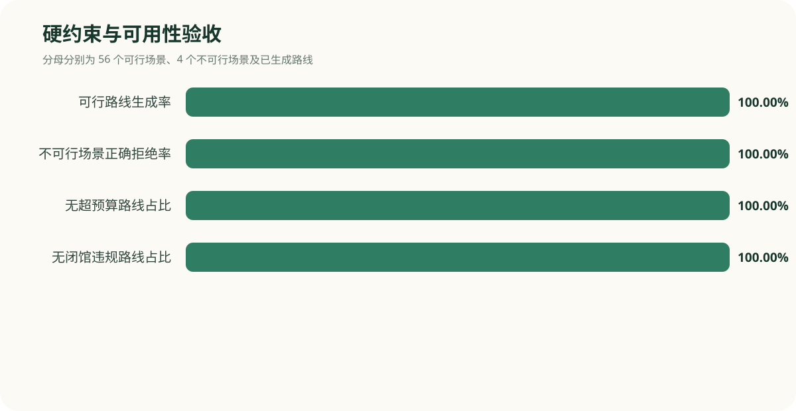
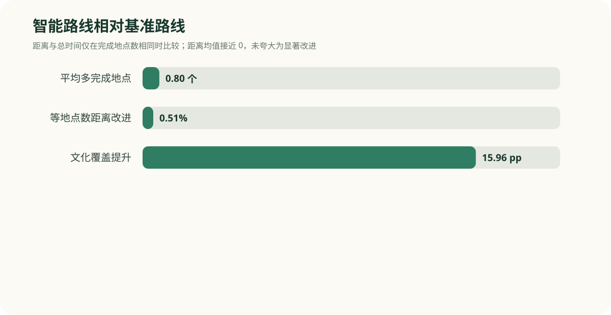
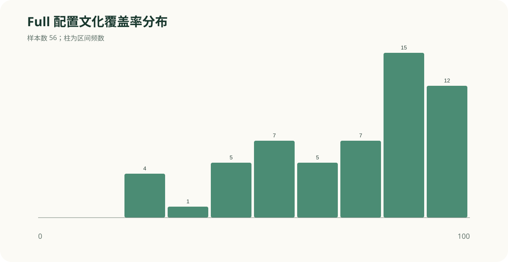
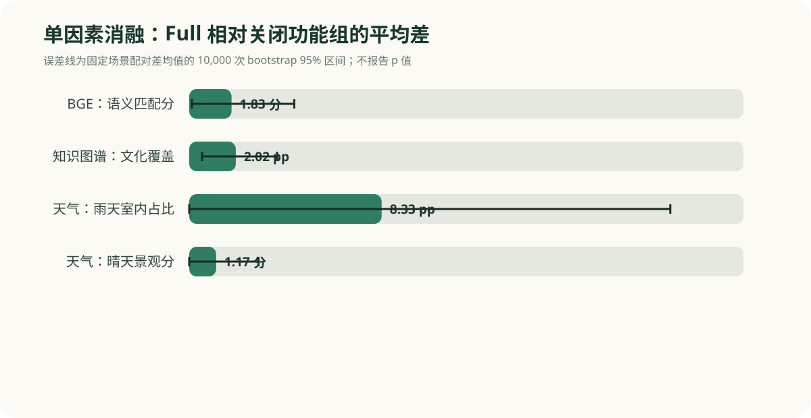
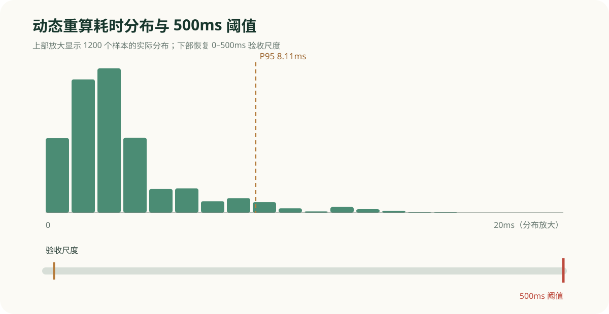
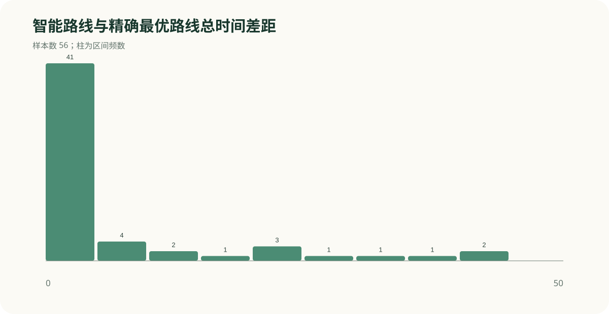

# 路线规划算法对照实验报告

> 生成时间：2026-09-28T07:02:31.720Z  
> 固定种子：20260928；Git SHA：`be18e94c5fd943b9de77cb13f07f08b83225edcc`

## 摘要

本实验使用 12 个南京文化慢游模板与 5 种出行情境组成 60 个固定场景，对基准路线、完整智能路线和 ≤5 POI 精确枚举最优路线统一验证，并执行 No-BGE、No-KG、No-Weather 三组单因素消融。共完成 240 组功能实验与 1200 个动态重算性能样本。

Full 配置在精确求解器判定可行的 56 个场景中生成率为 100%，对 4 个不可行场景的正确拒绝率为 100%；超预算率与闭馆违规率均为 0%。平均文化覆盖率为 72.4%，性能 P95 为 8.11ms，超过 500ms 的比例为 0.00%。

## 1. 系统与算法

- 基准路线：按用户勾选顺序执行时间窗截断。
- 智能路线：在预算、开放时间、临时关闭等硬约束内，综合真实离线路网、BGE 语义相关度、知识图谱覆盖、天气、景观、拥挤和夜间适宜性。
- 最优验证路线：对不超过 5 个 POI 的全部子集与顺序进行精确枚举，先最大化完成地点数，再最小化总时间与步行时间。
- 消融开关只移除对应决策贡献；后验评估器仍计算语义、文化和天气指标。

## 2. 场景与指标

60 个场景严格由六朝、民国、秦淮城南、明城墙、钟山、博物馆、佛教、湖泊慢游、低体力、无障碍、夜游和综合跨区 12 个模板，与雨天短时、早晨等开馆、临近闭馆、日间文化偏好、周末傍晚 5 个配置笛卡尔组合构成。56 个场景可行，4 个场景故意将候选点设为临时关闭，用于检验正确拒绝。

## 3. 三类路线对照

智能路线相对基准路线平均多完成 0.80 个地点（胜/平/负 30/26/0）。只在完成地点数相同的场景比较距离和总时间：距离平均改进 0.51%，总时间平均改进 -0.62%。后两者区间跨越 0，应解释为“没有稳定优势”，不能筛除负结果。文化覆盖率平均提升 15.96 个百分点。

精确验证显示智能路线完成地点数与精确解差值均为 0；等覆盖下总时间平均比精确最优高 5.91 分钟，31 个场景与精确解完全一致。

## 4. 消融实验

- No-BGE：Full 的语义匹配分平均高 1.83 分，胜/平/负 4/52/0。
- No-KG：Full 的文化覆盖率平均高 2.02 个百分点。
- No-Weather：雨天室内占比平均提高 8.33 个百分点；晴天景观分平均提高 1.17 分。雨天遮蔽分平均差为 0.00，如实保留该零结果。

## 5. 性能

先预热 30 次，再对每个场景重复 20 次，共 1200 个样本。平均 2.97ms，P50 2.53ms，P95 8.11ms，最大 15.40ms；超过 500ms 的比例 0.00%，两项发布门槛均通过。BGE 冷启动 139.69ms，暖推理 P95 4.72ms，未计入动态重算。

## 6. 数据边界与内部效度

这是固定工程基准，不是随机人群抽样，因此不使用显著性 p 值。置信区间仅描述 60 个固定场景的配对差不确定性。开放时间、拥挤、景观与舒适度中的部分字段是项目样本；路网矩阵是带时间戳的离线快照，不描述为实时城市数据。当前场景仅覆盖 23 个南京 POI 和不超过 5 点的小规模规划。

## 7. 复现

`npm run experiment:semantic` 生成真实本地 BGE 固定结果；`npm run experiment:routes` 生成 CSV/JSON；`npm run experiment:report` 生成图表与报告；`npm run experiment:verify` 检查口径与产物；`npm run experiment` 执行完整流水线。

## 图表

